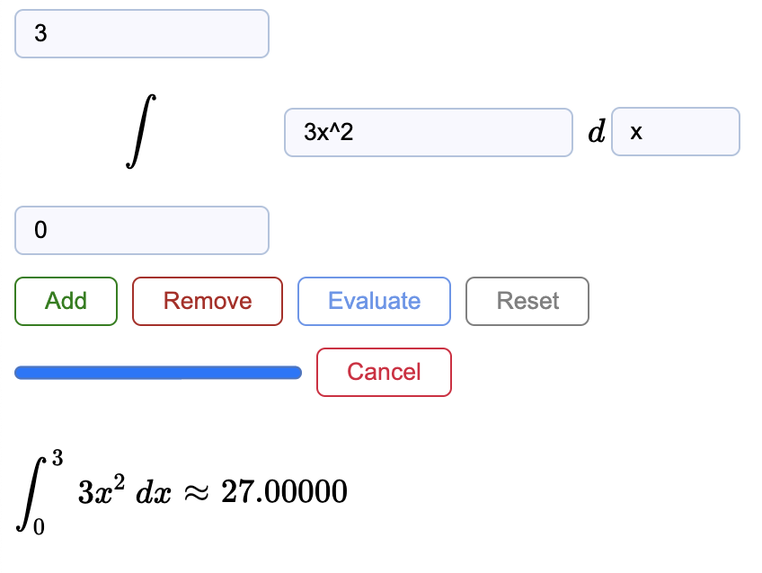
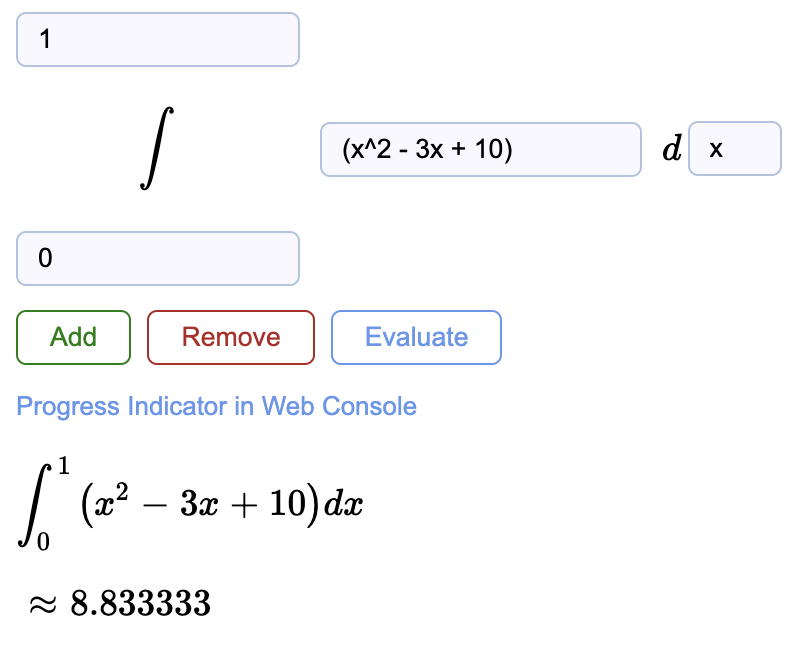
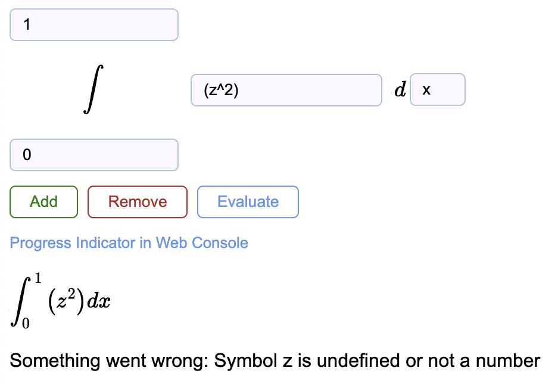

# Definite Integral Approximater
Can evaluate any number of definite integrals using Riemann Sums
* **Add** to add a new inner integral
* **Remove** to remove the inner most integral
* **Evaluate** to approximate the definite integrals
* **Reset** to revert back to a single uninitialized integral
* **Cancel** to cancel the calculation mid-operation

## How To Use
1. Clone repository and install dependencies
	```bash
	yarn add
	```
1. Run http server (necessary to enable web-worker)
	```bash
	npx http-server -o
	```
1. Ready to use!

## Progress Indicator
The progress bar updates after every 5% (can also be viewed in console)

## Features
* Asks for confirmation if you try to remove/reset if information is already filled in
* Allows use of greek letters in expression
	* Rendered with: **`MathJax`**
	* Evaluated with: **`evaluatex.js`**
* Uses web workers to offload computation from main thread
	* TODO: maybe implement multi-threading with sub-workers

## Snapshots




## Tools:
* http://asciimath.org/
* https://www.mathjax.org/
* https://arthanzel.github.io/evaluatex/