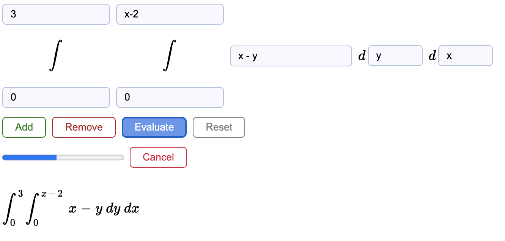
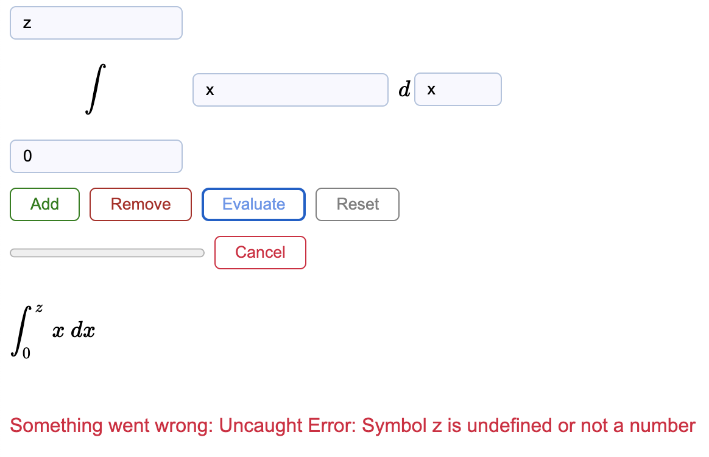

# Definite Integral Approximater
Can evaluate any number of definite integrals using Riemann Sums
* **Add** to add a new inner integral
* **Remove** to remove the inner most integral
* **Evaluate** to approximate the definite integrals

## Progress Indicator
Progress can be viewed in the browser console (prints after every 5%)

## Features
* Asks for confirmation if you try to remove an integral with information filled in
* Allowed to use greek letters in expression
	* Rendered with: **`MathJax`**
	* Evaluated with: **`evaluatex.js`**

## Snapshots

## References:
* http://asciimath.org/
* https://arthanzel.github.io/evaluatex/

## License
* Free for any personal/commercial use